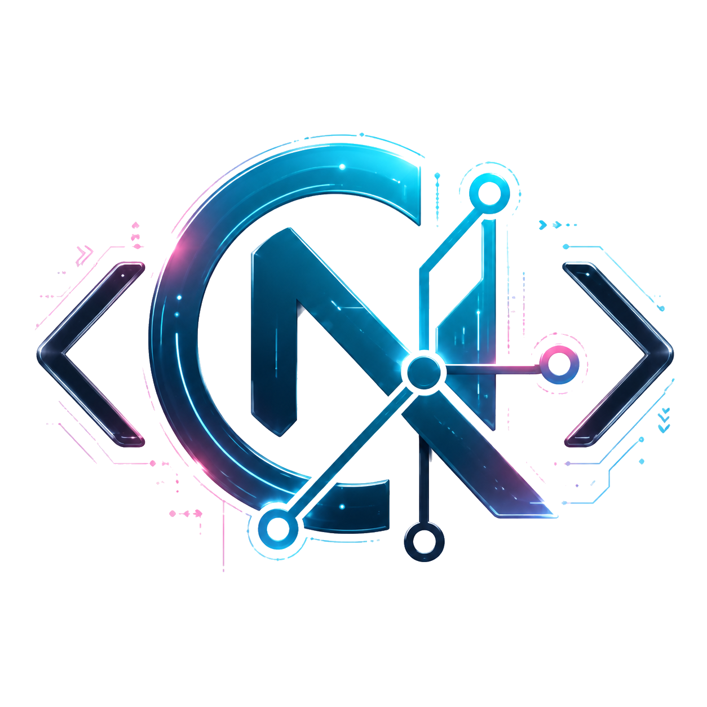
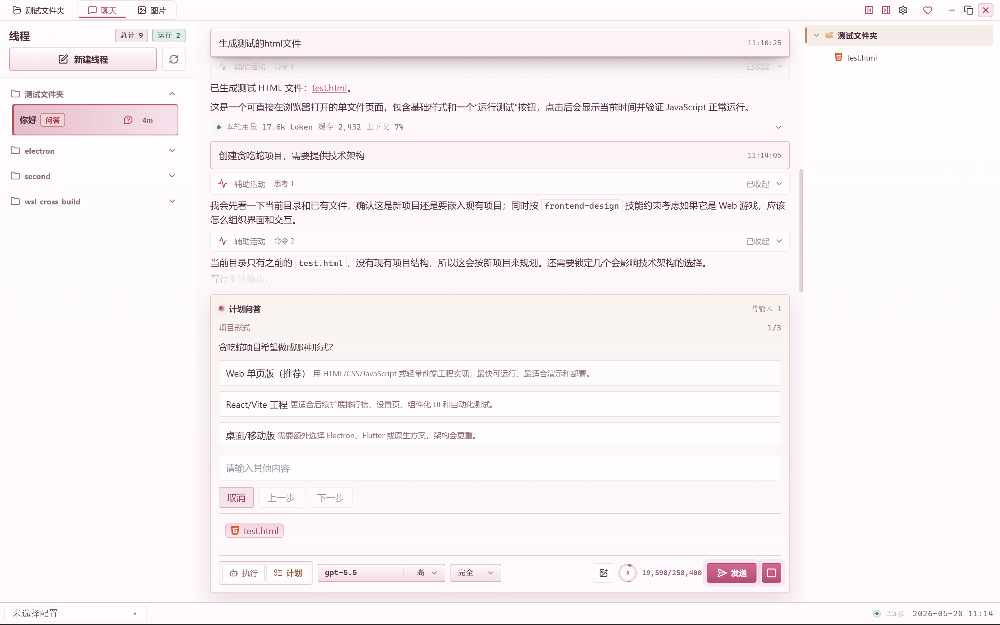
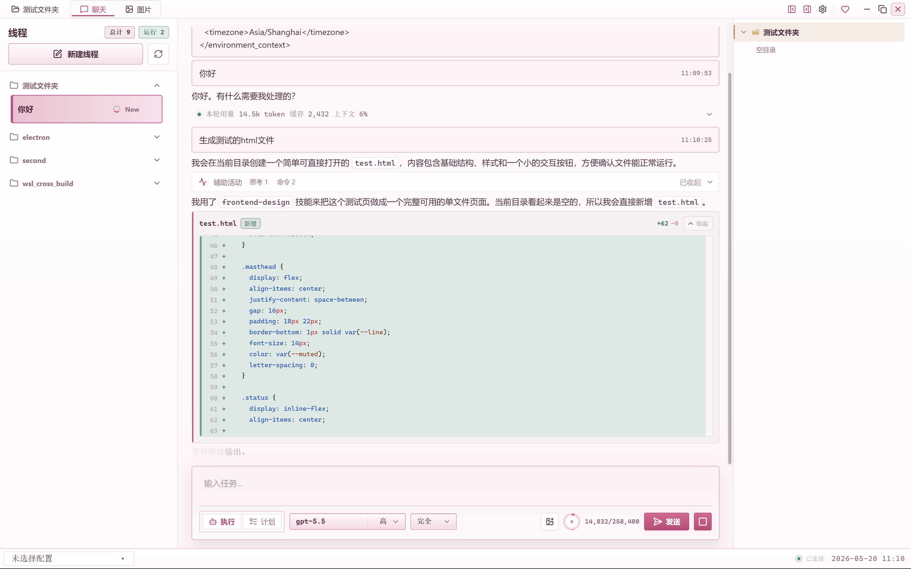
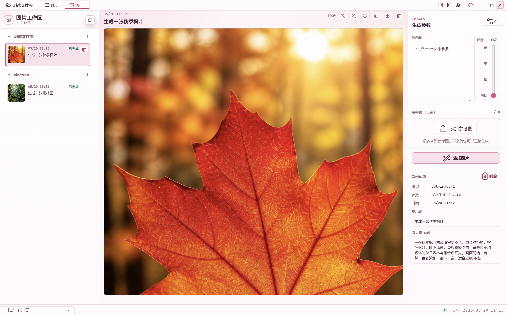
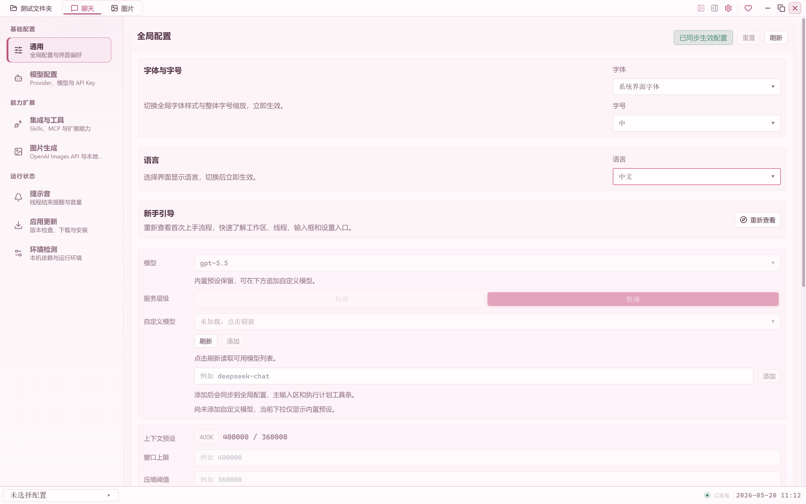

<p align="center">
  English | <a href="./README.zh-CN.md">简体中文</a>
</p>

<p align="center">
  
</p>

<h1 align="center">CodeNexus</h1>

<h3 align="center">Desktop workspace for Codex on Windows — built on the shoulders of giants.</h3>

<p align="center">
  CodeNexus brings Codex sessions, approvals, file changes, workspace context, and configuration into a focused desktop client.
</p>

<p align="center">
  <a href="https://github.com/zhenyue6612/codeNexus/releases/latest">
    
  </a>
  <a href="./LICENSE">
    
  </a>
  
  
  
  
  
</p>

<p align="center">
  <a href="https://github.com/zhenyue6612/codeNexus/releases/latest"><strong>Download Latest Release</strong></a>
  ·
  <a href="#screenshots">Screenshots</a>
  ·
  <a href="#highlights">Highlights</a>
  ·
  <a href="#development">Development</a>
  ·
  <a href="#contributing">Contributing</a>
</p>

---

## Overview

CodeNexus was built to make Codex app-server practical as a self-managed desktop workspace, rather than keeping the entire workflow inside a terminal. It focuses on the parts that matter during real agent work: understanding what happened, reviewing what changed, and keeping the local workspace under the user's control.

The app handles Codex app-server notifications directly and turns them into a desktop experience with timeline review, approval handling, custom themes, custom notification sounds, workspace file browsing, and a drag-friendly editor for local files.

CodeNexus also supports extending the agent runtime by injecting dynamic tools. The built-in `codenexus.image_generate` tool is wired into that path, so image generation can appear as a native part of the conversation and timeline instead of a separate external workflow.

CodeNexus is not an official OpenAI product. It is an independent desktop interface for Codex-oriented workflows.

## Screenshots

Project screenshots are stored under `docs/screenshots/`.

### Chat timeline



### Workspace and file changes



### Image generation workspace



### Settings



## Recent Updates

CodeNexus now visualizes streaming output from the Codex protocol, including command/process output deltas and streaming file-change updates. This makes long-running tool calls and patch activity easier to follow while a turn is still in progress.

This capability depends on Codex experimental protocol events. Enable the streaming output experimental feature in Settings before using it.

## Highlights

| Area               | What CodeNexus Provides                                                                                      |
| ------------------ | ------------------------------------------------------------------------------------------------------------ |
| Sessions           | Start and continue Codex threads in a persistent desktop workspace.                                          |
| Timeline           | Review protocol events, command activity, approvals, diffs, MCP calls, and system messages in context.       |
| Workspace          | Browse project files, open multiple editor tabs, save changes, and inspect agent edits visually.             |
| Approvals          | Handle command, patch, and permission requests through desktop-native review surfaces.                       |
| Settings           | Manage providers, models, skills, MCP, notifications, theme, fonts, and update behavior from one place.      |
| Windows Experience | Installer-oriented packaging, desktop window lifecycle handling, local path support, and update integration. |

## Requirements

| Dependency         | Requirement                         |
| ------------------ | ----------------------------------- |
| Operating system   | Windows 10 or Windows 11            |
| Node.js            | Current LTS recommended             |
| Package manager    | `pnpm@10`                           |
| Codex CLI baseline | `@openai/codex@0.131.0`             |
| Configuration      | CC Switch recommended for Codex CLI |

For Codex CLI provider, model, account, and environment configuration, use [CC Switch](https://github.com/farion1231/cc-switch), an all-in-one desktop manager for Claude Code, Codex, Gemini CLI, OpenCode, OpenClaw, and related agent tools.

After configuration, make sure Codex CLI is available:

```powershell
codex --version
```

## Development

Install dependencies and start the desktop app in development mode:

```powershell
pnpm install
pnpm run dev
```

Run local verification:

```powershell
pnpm run format:check
pnpm run lint
pnpm run typecheck
```

## Contributing

Contributions are welcome through pull requests. For code changes, please keep the scope focused, describe the user-facing behavior, and run the local checks before opening a PR.

Release publishing is handled by project maintainers through GitHub Actions. Contributors should not create release tags for normal PR work.

For local community discussion, a QQ group QR code can be added to the Chinese README when the image asset is available.

## Project Structure

| Path           | Purpose                                                         |
| -------------- | --------------------------------------------------------------- |
| `src/main`     | Electron main process, windows, IPC, and service orchestration. |
| `src/preload`  | Secure `contextBridge` preload layer.                           |
| `src/renderer` | Vue interface, Pinia stores, and runtime coordination.          |
| `src/shared`   | Cross-process contracts and protocol types.                     |
| `scripts`      | Development, build, icon, and utility scripts.                  |
| `music`        | Built-in notification audio resources.                          |

## Boundaries

- CodeNexus does not provide an OpenAI account, API token, hosted service, or model access.
- Model usage costs, workspace data handling, and local security remain the responsibility of the user.
- Third-party dependencies and bundled assets follow their respective upstream licenses.

## License

MIT. See [LICENSE](LICENSE).
