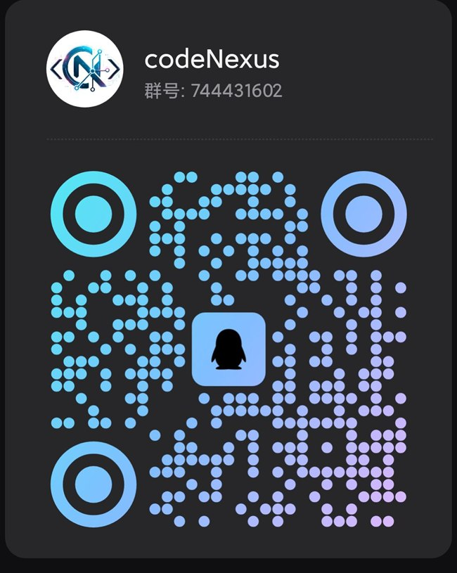

<p align="center">
  <a href="./README.md">English</a> | 简体中文
</p>

<p align="center">
  
</p>

<h1 align="center">CodeNexus</h1>

<h3 align="center">面向 Windows 的 Codex 桌面工作台 —— 站在巨人的肩膀上开发。</h3>

<p align="center">
  CodeNexus 将 Codex 会话、审批、文件变更、工作区上下文和配置管理整合到一个专注的桌面客户端中。
</p>

<p align="center">
  <a href="https://github.com/zhenyue6612/codeNexus/releases/latest">
    
  </a>
  <a href="./LICENSE">
    
  </a>
  
  
  
  
  
</p>

<p align="center">
  <a href="https://github.com/zhenyue6612/codeNexus/releases/latest"><strong>下载最新版本</strong></a>
  ·
  <a href="#运行效果">运行效果</a>
  ·
  <a href="#亮点">亮点</a>
  ·
  <a href="#本地开发">本地开发</a>
  ·
  <a href="#参与贡献">参与贡献</a>
</p>

---

## 概览

CodeNexus 的出发点，是把 Codex app-server 从终端里的协议能力，整理成一个可自己掌控的桌面工作台。实际使用 agent 时，真正需要被看清楚的是：发生了什么、改了哪些文件、哪些操作需要审批，以及当前工作区是否仍在自己的控制之下。

因此，当前项目可以理解为一个基于 Codex app-server 的自处理通知桌面端：它直接消费 app-server 通知，并把会话时间线、审批、文件变更、自定义主题、自定义通知音、工作区文件查看，以及支持拖动操作的本地文件编辑器整合到同一个界面中。

CodeNexus 还支持通过注入动态工具的方式扩展 agent 能力。内置的 `codenexus.image_generate` 工具已经接入这条路径，因此图片生成可以作为对话和时间线中的原生能力使用，而不是依赖额外的外部流程。

CodeNexus 不是 OpenAI 官方产品。它是围绕 Codex 工作流构建的独立桌面界面。

## 运行效果

项目运行效果截图统一放在 `docs/screenshots/` 目录下。

### 对话时间线


### 工作区与文件变更


### 图片生成工作区


### 设置


## 最近更新

CodeNexus 已经对 Codex 协议中的流式输出做了可视化处理，包括命令/进程输出增量和流式文件变更更新。长时间运行的工具调用、命令输出和 patch 过程可以在回合执行中持续展示，不需要等到最终结果返回后再查看。

该能力依赖 Codex 的实验性协议事件。使用前需要在设置中开启流式输出实验性功能。

## 亮点

| 领域         | CodeNexus 提供的能力                                                  |
| ------------ | --------------------------------------------------------------------- |
| 会话         | 在持久化桌面工作台中启动和继续 Codex 线程。                           |
| 时间线       | 按上下文查看协议事件、命令活动、审批、diff、MCP 调用和系统消息。      |
| 工作区       | 浏览项目文件，使用多标签编辑，保存变更，并直观检查 agent 修改内容。   |
| 审批         | 通过桌面化审阅界面处理命令、补丁和权限请求。                          |
| 设置         | 集中管理 Provider、模型、Skills、MCP、通知、主题、字体和更新行为。    |
| Windows 体验 | 面向安装包、窗口生命周期、本地路径处理和更新集成的 Windows 桌面体验。 |

## 环境要求

| 依赖           | 要求                              |
| -------------- | --------------------------------- |
| 操作系统       | Windows 10 或 Windows 11          |
| Node.js        | 建议使用当前 LTS 版本             |
| 包管理器       | `pnpm@10`                         |
| Codex CLI 基线 | `@openai/codex@0.135.0`           |
| 配置工具       | 推荐使用 CC Switch 配置 Codex CLI |

Codex CLI 的 Provider、模型、账号和环境配置，建议使用 [CC Switch](https://github.com/farion1231/cc-switch)。它是一个面向 Claude Code、Codex、Gemini CLI、OpenCode、OpenClaw 等 agent 工具的一体化桌面管理器。

配置完成后，确认 Codex CLI 可用：

```powershell
codex --version
```

## 本地开发

安装依赖并启动桌面应用开发模式：

```powershell
pnpm install
pnpm run dev
```

运行本地检查：

```powershell
pnpm run format:check
pnpm run lint
pnpm run typecheck
```

## 参与贡献

欢迎通过 Pull Request 参与贡献。提交代码改动前，请尽量保持改动范围清晰，说明用户可感知的行为变化，并先运行本地检查。

Release 发布由项目维护者通过 GitHub Actions 处理。普通贡献不需要创建发布 tag。

### 本地交流

可以扫码加入 QQ 群，交流使用体验、问题反馈和本地贡献协作。

<p align="left">
  
</p>

## 项目结构

| 路径                         | 用途                                                       |
| ---------------------------- | ---------------------------------------------------------- |
| `packages/app`               | Electron 应用壳、主进程、preload、渲染层、脚本和静态资源。 |
| `packages/shared`            | 跨进程基础契约、IPC 通道、设置和协议类型。                 |
| `packages/generated`         | Codex app-server 生成协议类型。                            |
| `packages/feature-paper`     | Paper 工作区状态和 Vue 工作台/侧栏组件。                   |
| `packages/feature-flowchart` | 流程图文档类型、历史服务、工作台和 AI 设置页。             |
| `packages/feature-imagegen`  | 图片生成类型、任务/历史服务、状态和组件。                  |
| `pnpm-workspace.yaml`        | workspace 包成员配置。                                     |

## 边界说明

- CodeNexus 不提供 OpenAI 账号、API Token、托管服务或模型访问能力。
- 模型使用成本、工作区数据处理和本地安全由使用者自行负责。
- 第三方依赖和内置资源遵循各自的上游许可证。

## License

MIT. See [LICENSE](LICENSE).
